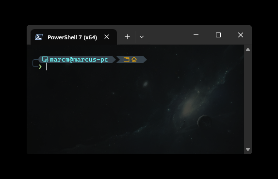

# DWM Border Remover

A lightweight Windows 11 tray app that removes the thin white/gray DWM border around normal application windows.

It keeps the effect applied as windows open, close, restore, switch focus, or move between virtual desktops—without leaving a PowerShell process running.



## Features

- Removes the Windows 11 one-pixel DWM border
- Tray icon with **Enabled**, **Options**, **Pick window**, **Reapply now**, and clean exit
- Include mode or exclude mode for per-program control
- Pick a running window with a global F8 selector
- Optional forced rounded, small-rounded, system-default, or square corners
- Automatic startup with Windows
- Low-resource event-driven operation
- Compatibility modes for applications that reset their DWM attributes
- Per-user Inno Setup installer and uninstaller
- Desktop and Start-menu shortcuts
- No network access, telemetry, service, driver, injection, or elevation required

## Compatibility modes

| Mode | Behavior |
|---|---|
| **Efficient** | Reacts to Windows events and performs one recovery scan per minute. |
| **Automatic** | Efficient mode plus a small periodic reapply pass only for known reset-prone Discord-family apps. Recommended. |
| **Aggressive** | Reapplies the attributes to every managed window every 750 ms. Use only for stubborn applications. |

## Known application behavior

### Steam

Steam draws parts of its own frame. Removing the DWM border can reveal a very thin dark outline or mismatched custom corners in some areas. The **Rounded** corner option may improve the shape, but an application-drawn outline cannot always be removed through DWM alone.

### Discord

Discord may periodically restore its own window attributes. **Automatic** mode reapplies border removal only to Discord, Discord PTB, Discord Canary, and Vesktop windows. Vencord transparency can also change how consistently Discord cooperates, but it is not required by the app.

### Custom-shaped windows

Some applications use custom regions, frameless Chromium windows, or their own shadows. Forced corner preferences are best-effort and may be ignored. Add problematic programs to the exclusion list when necessary.

## Install

Download the latest `DwmBorderRemover-Setup-*.exe` from Releases and run it.

The installer is per-user by default, creates a normal uninstaller, and can create a desktop shortcut. When upgrading while DWM Border Remover is running, Setup asks the app to restore the normal borders and exit through its local IPC channel, then restarts it automatically after the update.

The app stores settings in:

```text
%LOCALAPPDATA%\DwmBorderRemover\settings.json
```

## Usage

- **Double-click the tray icon** or desktop shortcut to open Options.
- **Right-click the tray icon** to enable/disable, pick a window, reapply, or exit.
- In the picker, hover the desired window and press **F8**.
- Exiting normally restores Windows' default borders on currently managed windows.

## Build

Requirements:

- Windows 11
- .NET 8 SDK
- Inno Setup 6 for the installer

```powershell
dotnet restore DwmBorderRemover.sln
dotnet publish src\DwmBorderRemover\DwmBorderRemover.csproj `
  -c Release -r win-x64 --self-contained true `
  -o artifacts\publish

& "$env:ProgramFiles(x86)\Inno Setup 6\ISCC.exe" installer\DwmBorderRemover.iss
```

GitHub Actions builds an installer artifact for pushes and pull requests. Tags matching `v*` create a GitHub release.

## How it works

For each managed top-level window, the app calls `DwmSetWindowAttribute` with:

- `DWMWA_BORDER_COLOR = DWMWA_COLOR_NONE`
- `DWMWA_WINDOW_CORNER_PREFERENCE` according to the selected corner option

`SetWinEventHook` catches normal window lifecycle and focus events. Timers are only used for recovery and compatibility behavior.
